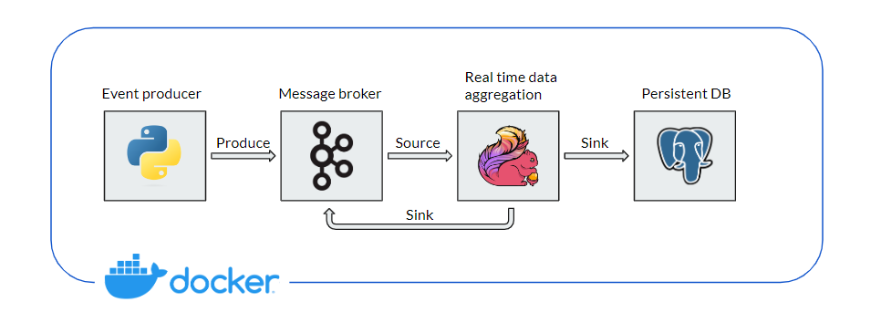
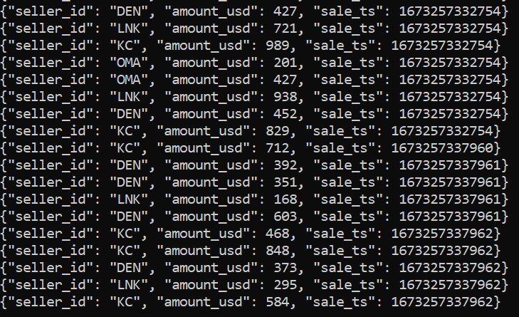
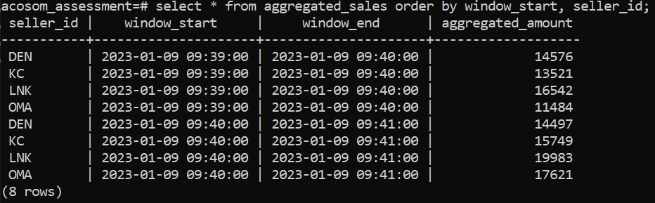

# Technical Assessment

For this technical assessment, we mimic the setup we had at my previous company to compute real-time aggregated data from streaming sources.

We set 3 constraints for this PoC:
1. Develop a fully containerized PoC
2. Work with Apache Kafka as data source (instead of RabbitMQ)
3. Persist aggregated metrics

## PoC description

For this PoC, we want to compute real-time aggregated data from sales events. More specifically, we want to compute the total sales amount over a tumbling window (non-overlapping time windows); per customer id. Also, we want to be able to observe the aggregated metrics live, as well as persist them to build up historical data.

To achieve this, we need to:
1. Generate sales events
2. Compute real-time aggregated metrics
3. Sink back the metrics to message broker; and persist to DB

## Chosen infrastructure

The chosen infrastructure looks like the below:



### Event producer

The event producer is a containerized python application that randomly create sales events with schema {"seller_id": string, "amount_usd": integer, "sale_ts": integer}; where the `seller_id` is picked from a list of 4 ids; and `sale_ts` is the timestamp of the sale event, taken as the epoch time when the record is created.

The records are pushed to the Kafka topic `sales-usd`.

Examples of records are shown below:



### Real-time data aggregation

Real-time aggregation is made with Apache Flink, using the Table API in streaming mode. The aggregated metrics are then sinked back to a new Kafka topic `aggregated-sales` for downstream applications; and are persisted in a postgreSQL table.

Examples of 1-minute aggregated sales data are shown below:



## Get the PoC up and running

### Build the required images

Download [apache-flink-libraries-1.16.0](https://pypi.org/project/apache-flink-libraries/#files) and [apache-flink-1.16.0](https://pypi.org/project/apache-flink/#files) `.tar.gz` files and put them in the folder `flink_cluster`. These files are required to build the pyflink image.

One needs to build the image for Flink with python and pyflink; as well as the image for the producer.

```console
$ cd acosom_assessment # cd to the project root directory

$ cd flink_cluster
$ docker build -t pyflink .

$ cd ../kafka_producer
$ docker build -t sales_producer .
```

### Deploy the infrastructure

To have the PoC running, one must first deploy the infrastructure.

To do so, open 1 terminal window and type the following commands:

```console
$ cd acosom_assessment # cd to the project root directory

$ cd kafka_cluster
$ docker compose up -d # start the kafka broker with zookeeper

$ ../postgres_db/start_psql.sh # start the postgres service

$ ../flink_job/start_cluster.sh # start Flink's JM and TM
```

The Flink UI can then be accessed on [http://localhost:8081/#/overview](http://localhost:8081/#/overview).

Open a new terminal window to start the Kafka producer and to submit the job to the Flink cluster:

```console
$ docker run -d --rm --name=sales_producer sales_producer

$ docker exec -it jobmanager bash
master@jobmanager: $ cd jobs
master@jobmanager: $ flink run -py main.py --jarfile ./jar_files/flink-sql-connector-kafka-1.16.0.jar --jarfile ./jar_files/flink-connector-kafka-1.16.0.jar # submit the job
```

To visualize aggregated data, open 2 new terminal windows (one to see th Kafka topic, one to see the SQL table):

```console
# First console
$ docker exec --interactive --tty broker \
  kafka-console-consumer --bootstrap-server broker:9092 \
                         --topic aggregated-sales \
                         --from-beginning
```

```console
# Second console
$ psql -h localhost -p 5432 -d acosom_assessment -U postgres
>> pwd: secret
acosom_assessment=# select * from aggregated_sales order by window_start, seller_id;
```

### Additional useful commands

```console
$ docker exec --interactive --tty broker \
  kafka-console-consumer --bootstrap-server broker:9092 \
                         --topic sales-usd \
                         --from-beginning
```